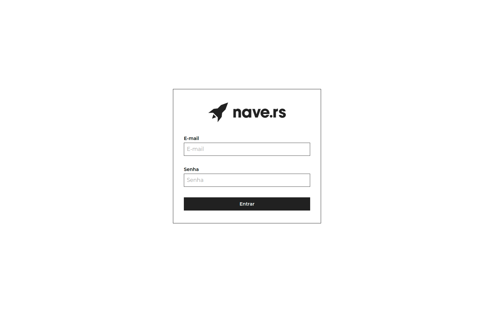
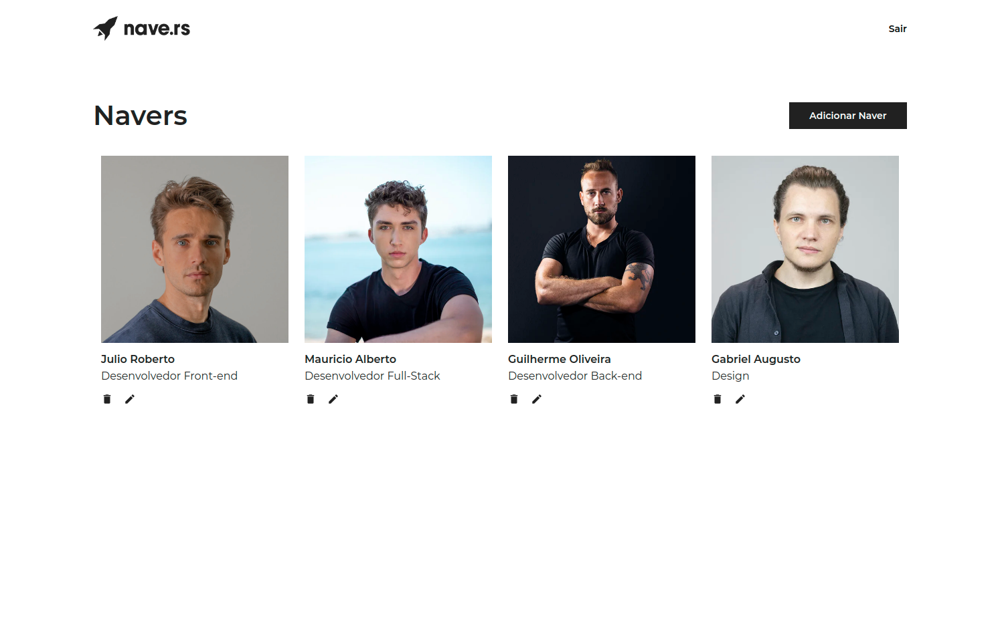
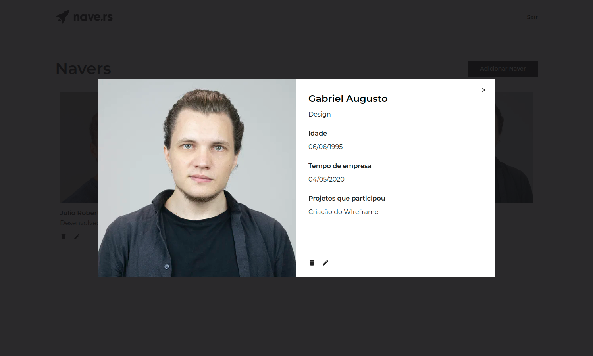
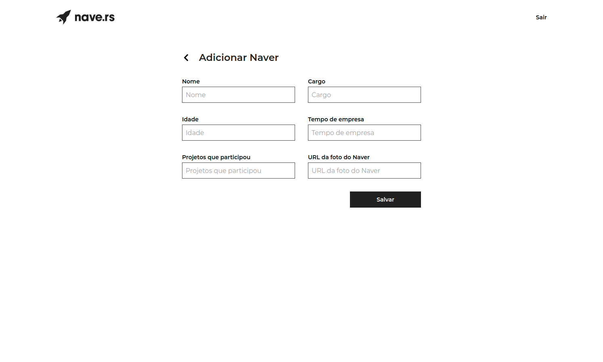

<h1 align="center">
 
Desafio Navedex
</h1>

Este projeto foi desenvolvido para resolver um desafio proposto por uma empresa de tecnologia, com o objetivo de avaliar as habilidades de React dos candidatos.

  

  
  
  
  

## Navedex

O sistema consiste em uma web app para visualização e criação dos navers, possuindo informações como: nomes, idades, cargos, tempo de empresa e projetos que participou.

## API

Para o desenvolvimento das funcionalidades dessa aplicação, foi utilizada uma API, que possui algumas funções como login e CRUD.

## Layout

Essa aplicação segue um layout que pode ser acessado em [here](https://www.figma.com/file/II8UDFm2uJFZaD0FOPcinP/Teste-Front-End?node-id=0%3A1).

## Funcionalidades do desafio

### Login

A web app deverá possuir um fluxo de autenticação, onde o usuário só pode acessar as telas internas do sistema (listagem, formulários) passando pela tela de login com as credenciais criadas previamente via Postman.

Para realizar o login, você deve usar a request de `users/login` disponível no postman. Essa request retornará um token do tipo `Bearer` que deverá ser utilizado no header das próximas requisições.

### Listagem

A página inicial da aplicação tera uma lista dos `navers`.

Para listar os `navers`, você deve usar a request de `navers/index` disponível no postman.

### Visualização

Ao clicar em algum `naver` da listagem, o usuário terá uma visualização completa das informações do mesmo.

Para apresentar um único `naver`, você deve usar a request de `navers/show` disponível no postman.
Para excluir um `naver`, você deve usar a request de `navers/delete` disponível no postman.

### Criação/edição

O usuário precisa ter a possibilidade de criar um novo `naver` ou editar um já existente.

Para criar um `naver`, você deve usar a request de `navers/create` disponível no postman.
Para editar um `naver`, você deve usar a request de `navers/update` disponível no postman.

### Bônus

Além das funcionalidades pedidas no desafio, foram adicionadas as seguintes:

- Responsividade: a aplicação está otimizada para dispositivos móveis.
- Testes unitários: a aplicação está com a grande maioria dos componentes e páginas cobertas por testes automatizados.

## Testes

- Para rodar os testes use `yarn test`
- Para rodar o relatório de cobertura dos testes rode `yarn test:coverage`

## Como rodar

- Clone o projeto > entre na pasta do projeto
- rode `yarn`
- rode `yarn start`

## Licença

[LICENSE](https://opensource.org/licenses/MIT)

---

Created with passion by me 👨🏻‍💻
